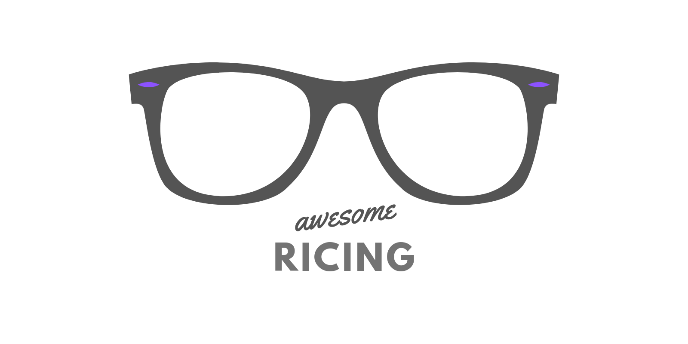

	

		
	

	 
	
 A curated list of awesome tools and technologies to make your Operating System look beautiful ❤️ 

	

## Contents

-   [Packages](#packages)
    -   [Terminals](#terminals)
    -   [Bars/Panels](#bars-and-panels)
    -   [Window manager](#window-managers)
    -   [CLI Tools](#cli-tools)
    -   [GUI Tools](#gui-tools)
    -   [Themes and ColorSchemes](#themes-and-colors-chemes)
    -   [Prompts](#prompts)
-   [Resources](#resources)
-   [Communities](#comminities)

## Packages

### Terminals

##### Cross Platform

-   [Alacritty](https://github.com/alacritty/alacritty) - A cross-platform, GPU-accelerated terminal emulator. (rust)
-   [Extraterm](https://github.com/sedwards2009/extraterm) - The swiss army chainsaw of terminal emulators. (typescript)
-   [Hyper](https://github.com/zeit/hyper) - A terminal built on web technologies. (javascript)
-   [Kitty](https://github.com/kovidgoyal/kitty) - The fast, featureful, GPU based terminal emulator. (c, python)
-   [Lxterminal](https://github.com/lxde/lxterminal) VTE terminal emulator written in GTK. (c)
-   [notty](https://github.com/withoutboats/notty) virtual terminal like xterm, gnome-vte,rxvt. (rust)
-   [qterminal](https://github.com/lxqt/qterminal) lightweight Qt terminal emulator based on QTermWidget. (c++)
-   [Termit](https://github.com/nonstop/termit) terminal emulator based on VTE library with Lua scripting. (c)
-   [Terminus](https://github.com/Eugeny/terminus) - A terminal for a more modern age. (typescript)
-   [Upterm](https://github.com/railsware/upterm) - A terminal emulator for the 21st century. (typescript)
-   [Wezterm](https://github.com/wez/wezterm) - A GPU-accelerated cross-platform terminal emulator and multiplexer. (Rust)
-   [Xiate](https://www.uninformativ.de/git/xiate/file/README.html) lightweight VTE-based terminal. (c)

##### Linux

-   [Aminal](https://github.com/liamg/aminal) - Golang terminal emulator from scratch. (go)
-   [cool-retro-term](https://github.com/Swordfish90/cool-retro-term) - A good looking terminal emulator which mimics the old cathode display. (qml)
-   [Guake](https://github.com/Guake/guake) - Drop-down terminal for GNOME. (python)
-   [Konsole](https://konsole.kde.org/) - Konsole is a terminal emulator for the K Desktop Environment. (c++)
-   [Pantheon](https://github.com/elementary/terminal) - Terminal emulator designed for elementary OS. (vala)
-   [Roxterm](http://roxterm.sourceforge.net/) - ROXTerm is a terminal emulator intended to provide similar features to gnome-terminal. (c)
-   [rxvt-unicode](http://software.schmorp.de/pkg/rxvt-unicode.html) - rxvt-unicode is a fork of the well known terminal emulator rxvt. (c)
-   [st](https://st.suckless.org/) - st is a simple terminal implementation for X. (c)
-   [Sakura](https://launchpad.net/sakura) - Simple but powerful libvte based terminal emulator. (c)
-   [Terminology](https://github.com/billiob/terminology) - The best terminal emulator based on the Enlightenment Foundation Libraries. (c)
-   [Termite](https://github.com/thestinger/termite/) - A keyboard-centric VTE-based terminal. (c++)
-   [Tilix](https://gnunn1.github.io/tilix-web/) - A keyboard-centric VTE-based terminal. (d)
-   [Tilda](https://github.com/lanoxx/tilda) - A Gtk based drop down terminal for Linux and Unix. (c)
-   [Terminator](https://gnometerminator.blogspot.com/p/introduction.html) - Terminal with the ability to create multiple terminals in one window and faster your work progress. (java)
-   [xfce4-terminal](https://github.com/xfce-mirror/xfce4-terminal) - Xfce Terminal is a lightweight and easy to use terminal emulator with advanced features (c)
-   [Xterm](http://invisible-island.net/xterm/) - The xterm program is a terminal emulator for the X Window System. (c)
-   [Yakuake](https://www.kde.org/applications/system/yakuake/) - Yakuake is a drop-down terminal emulator based on KDE Konsole technology. (c++)

##### MacOS

-   [Cathod](http://www.secretgeometry.com/apps/cathode/) - Cathode is a fully customizable terminal app with a look inspired by classic computers. (closed-source)
-   [iTerm2](https://github.com/gnachman/iTerm2) - iTerm2 is a terminal emulator for Mac OS X that does amazing things. (objective-c)
-   [Macterm](https://www.macterm.net/) - Powerful replacement for macOS Terminal. (python)
-   [Total Terminal](https://totalterminal.binaryage.com/) - a system-wide terminal available on a hot-key (objective-c, closed-source)
-   [Zoc terminal](https://www.emtec.com/zoc/) - SSH Client and Terminal Emulator for Windows and macOS. (closed-source)

##### Windows

-   [Babun](http://babun.github.io/) - A Windows shell you will love. (shell)
-   [ConEmu](https://github.com/Maximus5/ConEmu) - Customizable Windows terminal with tabs, splits, quake-style, hotkeys and more. (c++)
-   [Console](https://github.com/cbucher/console) - Modified version of Console 2 for a better experience. (c++)
-   [Cmder](https://github.com/cmderdev/cmder) - Lovely console emulator package for Windows. (c++)
-   [Mintty](https://mintty.github.io/) - Mintty is a terminal emulator for Cygwin, MSYS or Msys2, and derived projects, and for WSL. (c)
-   [MobaXterm](https://mobaxterm.mobatek.net/) - Enhanced terminal for Windows with X11 server, tabbed SSH client, network tools and much more.
    (closed-source)
-   [Windows-Terminal](https://github.com/microsoft/terminal) - Official windows terminal by microsoft. (C++)

##### Other

-   [GateOne](https://github.com/liftoff/GateOne) - Gate One is an HTML5-powered terminal emulator and SSH client. (javaScript)
-   [JQuery.terminal](https://terminal.jcubic.pl/) - A plugin for creating command line interpreters. (javascript)
-   [Xterm](https://github.com/termux/termux-app) - Android terminal and Linux environment. (java)
-   [Xterm.js](https://xtermjs.org/) - Xterm.js is a terminal front-end component written in JavaScript that works in the browser. (typescript)

### Bars and Panels

[Courtesy = @siduck76]

-   [barmaid.lua](https://github.com/ColumPaget/barmaid.lua) - A status-bar generation program for dzen2, lemonbar, or the terminal. (lua)
-   [barr](https://github.com/OkayDave/barr) - Barr is a status line style generator for LemonBar. (ruby)
-   [bevelbar](https://www.uninformativ.de/git/bevelbar/file/README.html) - Draw an X11 status bar with fancy schmancy 1985-ish beveled borders. (C)
-   [blockbar](https://gitlab.com/sambazley/blockbar) - Blocks based status bar for X window managers. (C)
-   [bmpanel](https://github.com/nsf/bmpanel) - lightweight, netwm compliant, x11 panel with desktop switcher, taskbar, systray and clock. (C)
-   [bumblebee-status](https://github.com/tobi-wan-kenobi/bumblebee-status) - A modular, theme-able status line generator for the i3wm. (python)
-   [cnx](https://github.com/mjkillough/cnx) - A simple X11 status bar for use with simple WMs. (rust)
-   [dwmbar-powerline](https://github.com/Leomv55/dwmbar-powerline) - dwmbar with powerline look. (go)
-   [dwmbar](https://github.com/thytom/dwmbar) - A Modular Status Bar for dwm. (shell)
-   [dzenbar](https://github.com/qbbr/dzenbar) - dzen2 bar w multiple monitors support. (shell)
-   [eww](https://github.com/elkowar/eww) - ElKowar's wacky widgets. (rust)
-   [fbpanel](https://github.com/aanatoly/fbpanel) - lightweight X11 desktop panel. (C)
-   [gobar](https://github.com/distatus/gobar) - minimalistic X status bar. (go)
-   [goblocks](https://github.com/davidscholberg/goblocks) - Fast, lightweight i3status . (go)
-   [goi3bar](https://github.com/denbeigh2000/goi3bar) - Configurable, extensible replacement . (go)
-   [i3blocks](https://github.com/vivien/i3blocks) - A flexible scheduler for your i3bar blocks. (C)
-   [i3status-rust](https://github.com/greshake/i3status-rust) - Very resourcefriendly and feature-rich replacement for i3status. (rust)
-   [i3status](https://github.com/i3/i3status) - Generates status bar to use with i3bar, dzen2 or xmobar. (C)
-   [lemonbar](https://github.com/LemonBoy/bar) - A featherweight, lemon-scented, bar based on xcb. (C)
-   [luastatus](https://github.com/shdown/luastatus) - universal status bar content generator. (C)
-   [lxpanel](https://github.com/lxde/lxpanel) - Lightweight X11 desktop panel. (C)
-   [mate-panel](https://github.com/mate-desktop/mate-panel) - MATE panel. (C)
-   [monky](https://github.com/monky-hs/monky) - Universal status bar content generator. (Hashkell)
-   [mowedline](https://github.com/retroj/mowedline) - A X status bar program. (scheme)
-   [oxbar](https://github.com/ryanflannery/oxbar) - configurable X11 status bar for OpenBSD. (C)
-   [perlpanel](https://savannah.nongnu.org/projects/perlpanel/) - Panel made for X11 wms like openbox , icewm. (perl)
-   [polybar](https://github.com/polybar/polybar) - A fast and easy to use bar. (C++)
-   [py3status](https://github.com/ultrabug/py3status) - py3status is an extensible i3status wrapper. (python)
-   [pypanel](http://pypanel.sourceforge.net) - lightweight panel/taskbar for X11 wms (python , C)
-   [quobar](https://github.com/tv42/quobar) - X11 status bar. (go)
-   [rust-dwm-status](https://github.com/pierrechevalier83/rust-dwm-status) - A status bar for dwm .(rust)
-   [statbar](https://github.com/pzl/statbar) - A Linux status bar, supporting multiple lightweight clients (multi-head). (C)
-   [statusbar](https://github.com/l3pp4rd/statusbar) - Statusbar for linux window manager. (go)
-   [taffybar](https://github.com/taffybar/taffybar) - A gtk based status bar for tiling window managers such as XMonad. (Hashkell)
-   [tianbar](https://github.com/koterpillar/tianbar) - A status bar for XMonad using WebKit for rendering. (Hashkell)
-   [tint2](https://gitlab.com/o9000/tint2) - A lightweight panel/taskbar for Linux and BSD. (C)
-   [tint3](https://github.com/jmc-88/tint3) - rewrite of the tint2 panel. (C)
-   [tinto-panel](https://github.com/chigoncalves/tinto-panel) - Tiny X11 panel. (C)
-   [unixbar](https://github.com/unrelentingtech/unixbar) - Rust library for creating output for UNIX-style desktop bars like i3bar/swaybar, dzen2, lemonbar. (rust)
-   [vala-panel](https://gitlab.com/vala-panel-project/vala-panel) - Vala rewrite of SimplePanel. (C)
-   [vbar](https://github.com/AndrewVos/vbar) - A lightweight bar written .(go)
-   [waybar](https://github.com/Alexays/Waybar) - Highly customizable Wayland bar for Sway and Wlroots based compositors. (C++)
-   [winbar](https://github.com/jmanc3/winbar) - A familiar X11 panel/dock to ease new linux users transitio. (C++)
-   [wingpanel](https://github.com/elementary/wingpanel) - Stylish top panel that holds indicators and spawns an application launcher. (vala)
-   [xfce4-panel](https://gitlab.xfce.org/xfce/xfce4-panel) - A panel made for xfce , should work on most stacking wms too. (C)
-   [xmobar](https://github.com/jaor/xmobar) - A minimalistic status bar. (Hashkell)
-   [yabar](https://github.com/geommer/yabar) - A modern and lightweight status bar for X window managers. (C)
-   [yagostatus](https://github.com/burik666/yagostatus) - Yet Another i3status replacement. (go)
-   [yambar](https://codeberg.org/dnkl/yambar) - Modular status panel for X11 and Wayland, inspired by polybar. (C)

### CLI Tools

##### System Monitors

-   [Htop](hisham.hm/htop/) - htop is an interactive text-mode process viewer for Unix systems. (C)
-   [Gotop](https://github.com/cjbassi/gotop) - A terminal based graphical activity monitor inspired by gtop and vtop. (go,C)
-   [gtop](https://github.com/aksakalli/gtop) - System monitoring dashboard for terminal. (js)
-   [ytop](https://github.com/cjbassi/ytop) - A TUI system monitor. (rust)
-   [Glances](https://github.com/nicolargo/glances) - Glances an Eye on your system. A top/htop alternative. (python)
-   [bashtop](https://github.com/aristocratos/bashtop) - Linux/OSX/FreeBSD resource monitor (bash)
-   [sampler](https://github.com/sqshq/sampler) - Tool for shell commands execution, visualization and alerting. Configured with a simple YAML file. (go)
-   [bottom](https://github.com/ClementTsang/bottom) - Yet another cross-platform graphical process/system monitor. (rust)
-   [vtop](https://github.com/MrRio/vtop) - A graphical activity monitor for the command line. (js)

##### CLI File mangers

[Courtesy - @siduck76]

-   [Ranger](https://github.com/ranger/ranger) - A VIM-inspired filemanager for the console. (python)
-   [Vifm](https://github.com/vifm/vifm) - Terminal file manager. (C)
-   [cfiles](https://github.com/mananapr/cfiles) - A ncurses file manager written in C with vim like keybindings. (C)
-   [cfm](https://github.com/willeccles/cfm) - Simple and fast TUI file manager with no dependencies. (C)
-   [clifm](https://github.com/leo-arch/clifm) - a completely CLI-based, shell-like and KISS file manager , lightweight as hell. (C)
-   [clifm](https://github.com/pasqu4le/clifm) - Command Line Interface File Manager. (Hashkell)
-   [dfm](https://github.com/cglindkamp/dfm) - Dynamic File Manager. (C)
-   [fff](https://github.com/dylanaraps/fff) - A simple file manager written in bash. (shell)
-   [hund](https://github.com/miahuoe/hund) - A minimalistic terminal file manager. (C)
-   [lf](https://github.com/gokcehan/lf) - Terminal file manager inspired by ranger. (go)
-   [mc](https://github.com/MidnightCommander/mc) - A free cross-platform orthodox file manager. (C)
-   [mfm](https://gitlab.com/dron2065/mfm) - Minimal File Manager with multiple tabs and no dependencies. (C)
-   [nnn](https://github.com/jarun/nnn) - n³ The unorthodox terminal file manager. (C)
-   [noice](https://git.2f30.org/noice/) - small file browser. (C)
-   [rover](https://github.com/lecram/rover) - simple file browser for the terminal. (C)
-   [sfm](https://github.com/afify/sfm/) - similar file manager. (C)
-   [xplr](https://github.com/sayanarijit/xplr) - A hackable, minimal, fast TUI file explorer. (Rust)

##### Misc Tools

-   [Cbonsai](https://gitlab.com/jallbrit/cbonsai) - grow bonsai trees in your terminal. (C)
-   [Chalk-Animation](https://github.com/bokub/chalk-animation) - Colorful animations on terminal. (javascript)
-   [Console-Services](https://github.com/chubin/awesome-console-services) - A curated list of awesome console services.
-   [fff](https://github.com/dylanaraps/fff) - A simple file manager written in bash. (shell)
-   [Lolcat](https://github.com/busyloop/lolcat) - Rainbows and unicorns. (ruby)
-   [musikcube](https://github.com/clangen/musikcube) - a cross-platform, terminal-based music player. (C++)
-   [nnn](https://github.com/jarun/nnn) - n³ The unorthodox terminal file manager. (C)
-   [No-More-Secrets](https://github.com/bartobri/no-more-secrets) - A command line tool that recreates the famous data decryption effect. (C)
-   [pywal](https://github.com/dylanaraps/pywal) - Generate and change color-schemes on the fly. (python)
-   [Ranger](https://github.com/ranger/ranger) - A VIM-inspired filemanager for the console. (python)
-   [Themer](https://github.com/mjswensen/themer) - themer takes a set of colors and generates themes for your apps. (javascript)
-   [Vifm](https://github.com/vifm/vifm) - Terminal file manager. (C)

##### Informative

-   [Getnews.tech](https://github.com/omgimanerd/getnews.tech) - A web server that fetches data from the News API and formats it for display in the terminal. (javascript)
-   [Howdoi](https://github.com/gleitz/howdoi) - instant coding answers via the command line. (python)
-   [Neofetch](https://github.com/dylanaraps/neofetch) - A command-line system information tool written in bash (shell)
-   [S-tui](https://github.com/amanusk/s-tui) - Terminal based CPU stress and monitoring utility. (python)
-   [Wtf](https://github.com/wtfutil/wtf) - The personal information dashboard for your terminal. (go)
-   [Wttr](https://github.com/chubin/wttr.in) - The right way to check the weather on terminal. (python)
-   [Wego](https://github.com/schachmat/wego) - Another weather app for terminal with cool ascii art. (go)

---

### Colorschemes

-   [base16 family](https://github.com/chriskempson/base16) - a collection of multiple color-schemes.
-   [Dracula](https://github.com/dracula/dracula-theme) - A Dark theme for all the things!.
-   [everforest](https://github.com/sainnhe/everforest) - Comfortable & Pleasant Color Scheme.
-   [Gogh](https://github.com/Mayccoll/Gogh) - Color Scheme for Gnome Terminal and Pantheon Terminal
-   [gruvbox](https://github.com/morhetz/gruvbox-contrib) - Retro groove color scheme.
-   [Nord](https://github.com/arcticicestudio/nord) - An arctic, north-bluish color palette.
-   [OneDark](https://github.com/nathanbuchar/atom-one-dark-terminal) - Atom One Dark theme for Terminal
-   [rose-pine](https://github.com/rose-pine/rose-pine-theme) - All natural pine, faux fur and a bit of soho vibes for the classy minimalist.
-   [tokyo-night](https://github.com/ghifarit53/tokyonight-vim) - A clean, dark colorscheme that celebrates the lights of downtown Tokyo at night.

### Prompts

-   [Pokemon](https://github.com/LazoCoder/Pokemon-Terminal) - Pokemon terminal themes
-   [Powerlevel9k](https://github.com/bhilburn/powerlevel9k) - Legacy prompt for ZSH
-   [Powerlevel10k](https://github.com/romkatv/powerlevel10k) - A Zsh theme revolves around customization and speed
-   [Pure](https://github.com/sindresorhus/pure) - Pretty, minimal and fast ZSH prompt
-   [Spaceship](https://github.com/denysdovhan/spaceship-prompt) - A Zsh prompt for Astronauts

#### TODO:

-   More color palette
-   Add wallpaper sources
-   Add Resources(Tutorials and Articles)

## Related lists

-   [awesome-awesome-wm](https://github.com/atsepkov/awesome-awesome-wm) - A curated list of awesome tools/scripts/configs for Awesome Window Manager.
-   [terminals are sexy](https://github.com/k4m4/terminals-are-sexy) - A curated list of Terminal frameworks, plugins & resources for CLI lovers.

**[⬆ back to top](#contents)**

## Contributing

Your contributions are always welcome! Please take a look at our [contribution guidelines](https://github.com/Sparkenstein/awesome-ricing/blob/master/contributing.md) and [code of conduct](https://github.com/Sparkenstein/awesome-ricing/blob/master/code-of-conduct.md) first.

## License

To the extent possible under law, [Sparkenstein](https://github.com/Sparkenstein) has waived all copyright and related or neighboring rights to this work.
